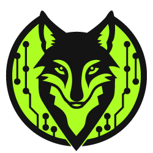

# Ethical Hacking: Essential Concepts

> #TLDR | Before we start...
> 
> Ethical hacking requires a strong foundation in various aspects of technology, including operating systems, file systems, networking, web technologies, and security. 
> 
> This note covers the key pre-requisite concepts to start navigating the Ethical Hacking path with ease. I personally advise to have these concepts well structured before moving forward to the remaining course topics, as they're constantly brought up.
> 
> Not being familiarized with them, might be a frustration point and learning deterrent. 
> We don't want that... that said, this is the starting point of a very exciting and powerful learning experience! Refer to this page, the glossary or the community whenever in doubt.

**Good luck – go out there and show them what you’re made of!**

---

## What We Get From This Exercise
###### #Objectives

- **Understand Operating System Concepts**
- **Explore Different Types of File Systems**
- **Master Computer Network Fundamentals**
- **Learn Basic Network Troubleshooting Techniques**
- **Comprehend Virtualization Concepts**
- **Understand Network File Systems (NFS)**
- **Familiarize with Web Markup and Programming Languages**
- **Explore Application Development Frameworks and Vulnerabilities**
- **Summarize Web Components and Database Connectivity**
- **Grasp Information Security Controls**
- **Understand Network Segmentation and Security Solutions**
- **Explore Data Leakage and Data Backup Processes**
- **Learn Risk Management Concepts**
- **Understand Business Continuity and Disaster Recovery**
- **Familiarize with Cyber Threat Intelligence and Threat Modeling**
- **Summarize Penetration Testing Phases**
- **Explore Security Operations and Forensics**
- **Comprehend Software Development Security**
- **Understand Security Governance and Asset Management**

---

## Table of Contents

1. [Operating System Concepts](#1-operating-system-concepts) 
2. [Different Types of File Systems](#2-different-types-of-file-systems)
3. [Computer Network Fundamentals](#3-computer-network-fundamentals)
4. [Network Troubleshooting Techniques](#4-network-troubleshooting-techniques)
5. [Virtualization Concepts](#5-virtualization-concepts)
6. [Network File Systems (NFS)](#6-network-file-systems)
7. [Web Markup and Programming Languages](#7-web-markup-and-programming-languages)
8. [Application Development Frameworks](#8-application-development-frameworks)
9. [Web Components and Database Connectivity](#9-web-components-and-database-connectivity)
10. [Information Security Controls](#10-information-security-controls)
11. [Network Segmentation](#11-network-segmentation)
12. [Network Security Solutions](#12-network-security-solutions)
13. [Data Leakage and Data Backup](#13-data-leakage-and-data-backup)
14. [Risk Management](#14-risk-management)
15. [Business Continuity and Disaster Recovery](#15-business-continuity-and-disaster-recovery)
16. [Cyber Threat Intelligence](#16-cyber-threat-intelligence)
17. [Threat Modeling](#17-threat-modeling)
18. [Penetration Testing Phases](#18-penetration-testing-phases)
19. [Security Operations](#19-security-operations)
20. [Computer Forensic Investigation](#20-computer-forensic-investigation)
21. [Software Development Security](#21-software-development-security)
22. [Security Governance](#22-security-governance)
23. [Asset Management](#23-asset-management)

---

## 1. **Operating System Concepts**

> An operating system (OS) is the software that manages computer hardware and software resources, providing services for computer programs. There are several key areas within OS concepts:

- **Kernel and User Mode**: The OS operates in two main modes. In **kernel mode**, the OS has unrestricted access to hardware resources, and core processes run here. **User mode** is where applications operate, with restricted access to resources.
- **Process Management**: OS schedules and manages processes (active programs) to ensure efficient use of the CPU. Techniques like multitasking and multiprocessing are key.
- **Memory Management**: The OS manages system memory (RAM) through techniques like paging and segmentation. It ensures each application gets enough memory and prevents memory leaks.
- **File System Management**: The OS manages files and directories, facilitating creation, deletion, and organization of data on storage devices.
- **OS Types**: Popular OS types include:
  - **Windows**: Known for its GUI, widely used in personal and enterprise environments.
  - **Linux/UNIX**: Preferred for servers and security tasks due to its robustness and command-line tools.
  - **macOS**: A UNIX-based OS widely used in creative and business environments.

---

## **2. Different Types of File Systems**

> A file system organizes how data is stored and retrieved on storage devices. Different file systems are optimized for different purposes.

- **FAT (File Allocation Table)**: A simple file system used in early Windows versions, primarily on smaller storage devices. Its main drawback is the lack of security features like permissions.
- **NTFS (New Technology File System)**: The default file system for modern Windows systems, offering advanced features like:
  - **Access Control Lists (ACLs)**: Define fine-grained permissions on files and directories.
  - **File Compression and Encryption**: NTFS supports transparent file compression and encryption via EFS (Encrypting File System).
  - **Journaling**: Keeps a log of changes to help recover data in the event of a system crash.
- **EXT (Extended File System)**: Primarily used by Linux. Variants include:
  - **EXT2**: The first modern Linux file system, supporting large files but lacking journaling.
  - **EXT3**: Introduced journaling for improved reliability.
  - **EXT4**: The most advanced version, with improvements like extents (blocks of consecutive storage) and better performance for large files.

---

## **3. Computer Network Fundamentals**

> Networks enable the connection of devices to communicate and share resources. Key concepts include:

- **OSI Model**: The **Open Systems Interconnection (OSI)** model divides network communication into seven layers, providing a framework for understanding how different networking protocols interact:
  - **Layer 1 (Physical)**: Transmits raw bit streams over physical media (e.g., Ethernet cables).
  - **Layer 2 (Data Link)**: Responsible for node-to-node data transfer and error detection.
  - **Layer 3 (Network)**: Manages packet routing through logical addressing (e.g., IP).
  - **Layer 4 (Transport)**: Ensures reliable delivery of data between devices (e.g., TCP).
  - **Layer 5 (Session)**: Establishes, manages, and terminates connections between applications.
  - **Layer 6 (Presentation)**: Translates data into a readable format (e.g., encryption, compression).
  - **Layer 7 (Application)**: Interfaces with end-user applications (e.g., HTTP, FTP).

> [!MNEMONIC]
> All People Seem To Need Data Protection 
  
- **TCP/IP Model**: A streamlined version of the OSI model, focusing on four layers:
  - **Application Layer**: Supports protocols like HTTP, SMTP, and FTP.
  - **Transport Layer**: Manages data transfer reliability using TCP or connectionless communication with UDP.
  - **Internet Layer**: Routes packets across networks using IP addresses.
  - **Network Access Layer**: Defines how data is transmitted over the physical network.

---

## **4. Network Troubleshooting Techniques**

> Troubleshooting network issues is essential for ensuring continuous connectivity and security. Common troubleshooting techniques include:

- **Ping**: A basic utility to check the connectivity between two devices by sending ICMP echo requests.
- **Traceroute**: Helps identify the path packets take across the network, useful for pinpointing network congestion or failures.
- **Nmap**: A network scanning tool used to discover devices, open ports, and services running on a network.
- **Netstat**: Displays active connections, listening ports, and routing tables, helping to troubleshoot connection issues or identify unauthorized connections.
- **Packet Sniffers (e.g., Wireshark)**: Capture and analyse network traffic to identify issues like malformed packets or network congestion.

---

## **5. Virtualization Concepts**

> Virtualization enables running multiple virtual machines (VMs) on a single physical machine, optimizing resource utilization.

- **Hypervisor**: The core component of virtualization that manages VMs. Two types of hypervisors:
  - **Type 1 (Bare Metal)**: Runs directly on the hardware without a host OS (e.g., VMware ESXi, Microsoft Hyper-V).
  - **Type 2 (Hosted)**: Runs on top of an existing OS (e.g., VirtualBox, VMware Workstation).
  
- **Benefits of Virtualization**:
  - **Resource Efficiency**: Multiple VMs share the same physical resources.
  - **Isolation**: VMs are isolated from each other, improving security.
  - **Scalability**: Easily scale resources up or down by adding or removing VMs.

---

## **6. Network File Systems (NFS)**

> Network File System (NFS) allows users to access files over a network as if they were on the local machine. Key points include:

- **NFS**: A distributed file system protocol developed by Sun Microsystems, primarily used in UNIX and Linux environments. It enables users to mount remote directories and interact with them as though they were local.
- **SMB/CIFS**: The Windows counterpart to NFS, used for file and printer sharing across Windows-based networks.
- **NFS Security**: NFS can be secured with **Kerberos** for authentication and encryption to prevent unauthorized access to shared files.

---

## **7. Web Markup and Programming Languages**

> Web technologies enable the creation of interactive web applications. These include:

- **HTML (Hypertext Markup Language)**: The standard language for creating web pages. It defines the structure and layout of web content.
- **CSS (Cascading Style Sheets)**: A styling language used to format the appearance of HTML elements, allowing for design customization.
- **JavaScript**: A client-side scripting language that adds interactivity to web pages. JavaScript can manipulate the DOM (Document Object Model) to dynamically update content.
- **PHP**: A server-side scripting language used to build dynamic web pages. PHP interacts with databases and manages back-end logic.
- **Python**: Used in web development for server-side scripting and in frameworks like **Django** for rapid web application development.

---

## **8. Application Development Frameworks**

> Frameworks streamline the development of web applications by providing pre-built components and tools:

- **Django (Python)**: A high-level framework that promotes clean design and rapid development. It comes with built-in security features like CSRF protection and SQL injection prevention.
- **Laravel (PHP)**: A robust PHP framework that simplifies tasks like authentication, routing, and caching. Developers must ensure proper input validation to prevent vulnerabilities.
- **Spring (Java)**: A popular Java framework used for enterprise applications. Improper configuration can lead to vulnerabilities such as remote code execution.

---

## **9. Web Components and Database Connectivity**

> Web components and database connectivity are essential for building modern, dynamic web applications.

- **Web Components**: Reusable pieces of code that can encapsulate HTML, CSS, and JavaScript. Examples include headers, footers, and modal dialogs.
- **Database Connectivity**: Web applications connect to databases via various protocols:
  - **SQL (Structured Query Language)**: Used to interact with relational databases like MySQL and PostgreSQL.
  - **NoSQL**: Databases like MongoDB that store data in a non-relational format, useful for large-scale applications that require flexibility.

---

## **10. Information Security Controls**

> Information security controls protect data and systems from threats. They are divided into three main types:

- **Administrative Controls**: Policies, procedures, and

 guidelines that dictate how security is managed within an organization.
  - **Examples**: Employee training, security policies, incident response plans.
  
- **Technical Controls**: Automated security mechanisms that prevent unauthorized access or misuse of systems.
  - **Examples**: Firewalls, encryption, intrusion detection systems (IDS).
  
- **Physical Controls**: Measures that protect the physical infrastructure from unauthorized access.
  - **Examples**: Locks, surveillance cameras, biometric access controls.

---

## **11. Network Segmentation**

> Network segmentation improves security by dividing a network into smaller, isolated parts:

- **DMZ (Demilitarized Zone)**: A network segment that exposes external-facing services (e.g., web servers) to the internet while protecting internal systems.
- **VLANs (Virtual Local Area Networks)**: Used to create logical separation between devices on the same physical network, improving security and traffic management.

---

## **12. Network Security Solutions**

> Protecting a network involves using a combination of solutions to mitigate risks:

- **Firewalls**: Devices or software that monitor and control incoming and outgoing network traffic based on predetermined security rules.
- **IDS/IPS (Intrusion Detection/Prevention Systems)**: Monitors network traffic for suspicious activities and takes action to prevent or alert on intrusions.
- **VPN (Virtual Private Network)**: A secure tunnel between a user and a network, commonly used to protect sensitive data over public networks.

---

## **13. Data Leakage and Data Backup**

> Data leakage occurs when sensitive data is transferred to unauthorized parties. Strategies to prevent it include:

- **Data Loss Prevention (DLP)**: Technologies that monitor and control data transfer to prevent leakage.
  
Data backup is the process of copying and archiving important data to ensure recovery in case of data loss:

- **Backup Types**:
  - **Full Backup**: A complete copy of all data.
  - **Incremental Backup**: Backs up only the data that has changed since the last backup.
  - **Differential Backup**: Backs up data that has changed since the last full backup.

---

## **14. Risk Management**

> Risk management involves identifying, assessing, and mitigating risks to minimize potential damage:

- **Risk Identification**: The process of finding potential security risks to systems and data.
- **Risk Assessment**: Evaluates the impact and likelihood of identified risks, prioritizing them for mitigation.
- **Risk Mitigation**: Implementing controls to reduce the severity of risks. Strategies include avoidance, acceptance, transfer, or mitigation.

---

## **15. Business Continuity and Disaster Recovery**

> Business continuity ensures that critical business functions remain operational during and after a disaster, while disaster recovery focuses on restoring IT infrastructure:

- **Business Continuity Plan (BCP)**: A comprehensive plan that includes strategies for keeping business functions running during an incident.
- **Disaster Recovery (DR)**: The process of recovering IT systems and data after a disaster, such as using backups or redundant systems.

---

## **16. Cyber Threat Intelligence**

> Cyber threat intelligence (CTI) refers to the collection and analysis of information about potential threats:

- **Types of CTI**:
  - **Strategic**: High-level insights into the threat landscape, usually used for long-term planning.
  - **Operational**: Focuses on immediate, actionable threats.
  
CTI can be gathered from various sources, including **open-source intelligence (OSINT)**, threat feeds, and dark web monitoring.

---

## **17. Threat Modelling**

> Threat modelling is a process used to identify and mitigate potential security threats:

- **Identify Assets**: Determine the assets that need protection.
- **Identify Threats**: analyse the various threats that could target these assets.
- **Mitigate Threats**: Develop countermeasures to minimize the impact of potential threats.

---

## **18. Penetration Testing Phases**

> Penetration testing is a method of simulating an attack to identify vulnerabilities in a system. Phases include:

- **Reconnaissance**: Gathering as much information as possible about the target.
- **Scanning**: Identifying active hosts, open ports, and services.
- **Exploitation**: Attempting to exploit identified vulnerabilities.
- **Post-Exploitation**: Maintaining access and covering tracks.
- **Reporting**: Documenting findings and recommendations for remediation.

---

## **19. Security Operations**

> Security operations involve continuous monitoring and management of security within an organization:

- **SOC (Security Operations Center)**: A centralized team responsible for monitoring, detecting, and responding to security incidents.
- **Threat Hunting**: Proactively searching for hidden threats or vulnerabilities within the network.
- **Incident Response**: A structured approach for dealing with security breaches, including detection, containment, eradication, and recovery.

---

## **20. Computer Forensic Investigation**

> Forensic investigation focuses on collecting and analyzing digital evidence following a security incident. Phases include:

- **Acquisition**: Collecting data in a way that maintains its integrity.
- **Analysis**: Reviewing the data to find evidence of malicious activity.
- **Reporting**: Documenting the findings in a way that can be used in legal proceedings.

---

## **21. Software Development Security**

> Secure software development ensures that applications are resistant to security threats:

- **Secure Coding**: Practices like input validation, encryption, and error handling reduce the risk of vulnerabilities like SQL injection or cross-site scripting (XSS).
- **Code Reviews**: Periodic reviews of code to identify potential security flaws before they are deployed.

---

## **22. Security Governance**

> Security governance refers to the framework through which an organization manages and controls its security policies:

- **Policies**: High-level statements that define the organization’s security objectives.
- **Standards**: Detailed, mandatory requirements that support policies.
- **Procedures**: Step-by-step instructions on how to implement standards.

---

## **23. Asset Management**

> Asset management ensures that all IT assets are accounted for and properly protected:

- **Asset Inventory**: Maintaining a complete list of all physical and digital assets.
- **Asset Classification**: Assigning security classifications to assets based on their sensitivity, which helps prioritize protection efforts.

---
